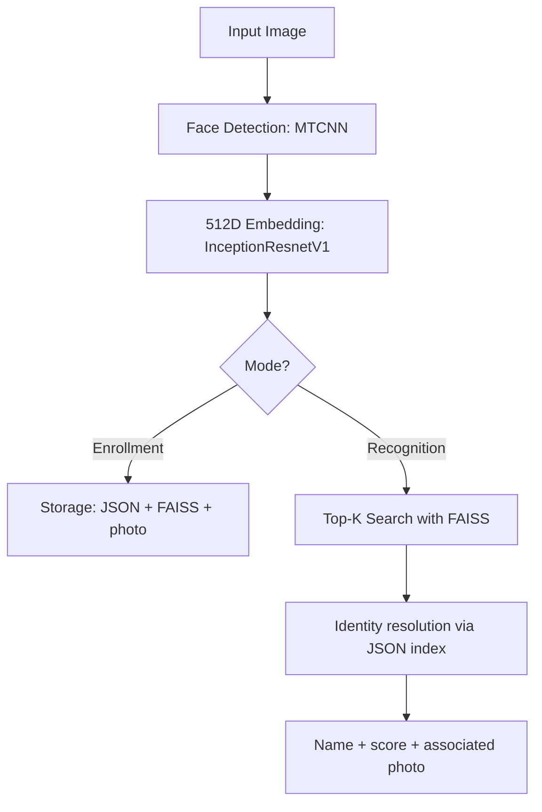
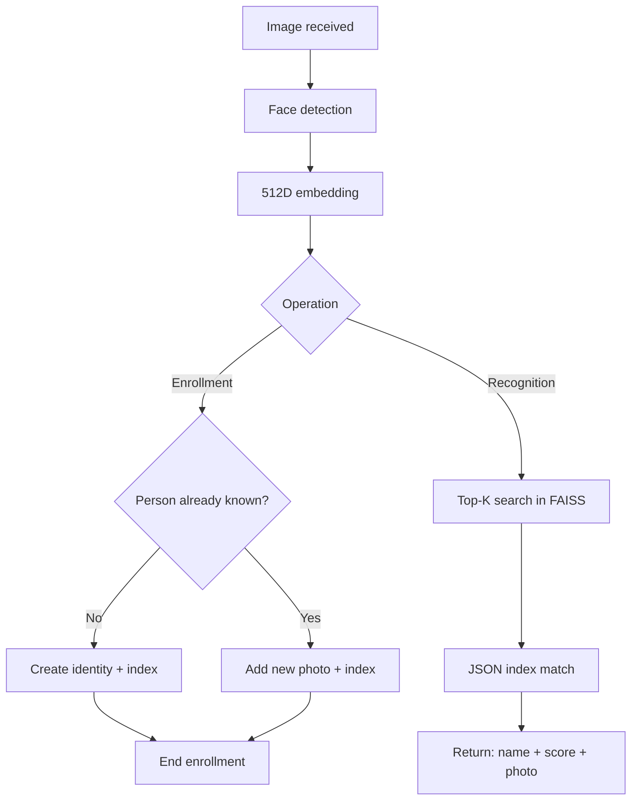
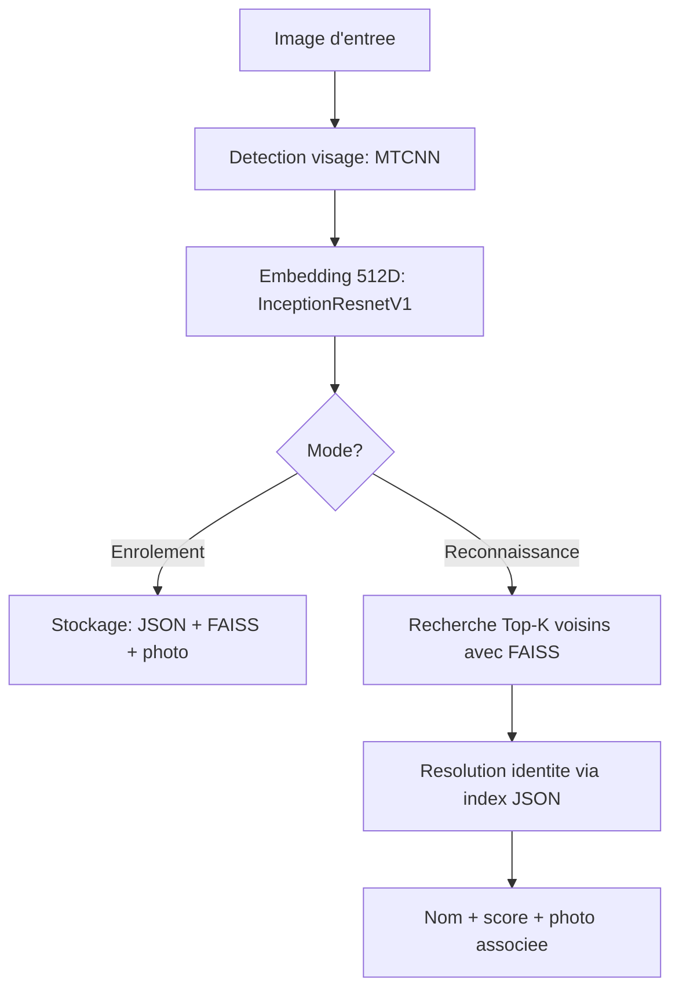
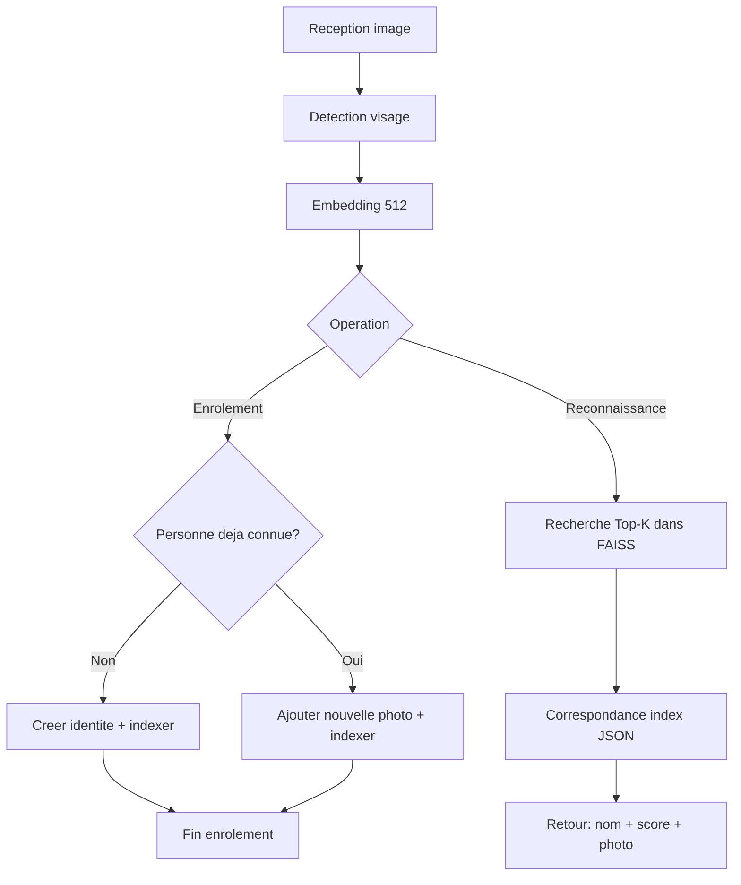

# DeepScan
A facial recognition model using FAISS and FaceNet

---

## English Version

# Face Detection and Recognition Pipeline

This document describes the overall operation of the project in two phases:

1. **Enrollment**: adding a new photo/person to the database.
2. **Recognition**: identifying a person from an image.

---

## 1. Overview

---

## 2. Enrollment Phase (adding to the database)

### Goal
Add a reference image for a person and update the search indexes.

### Steps

1. **Obtain a photo** (source image).
2. **Check if the person already exists** in the database.
3. **Detect the face** using MTCNN.
4. **Generate the embedding** of shape `(1, 512)` with InceptionResnetV1.
5. **Update storages**:
	 - add the photo to the database/image files,
	 - add the entry to the JSON mapping (index -> identity/photo),
	 - add the vector to the `faiss.index`.

### Business Logic (existence)

- **If the person does not exist**:
	- create a new entity (new identifier),
	- save their photo and embedding,
	- index in JSON + FAISS.
- **If the person already exists**:
	- add the new photo,
	- extract and save its embedding,
	- add the corresponding index in JSON + FAISS.

---

## 3. Recognition Phase

### Goal
Identify the most probable person from a query image.

### Steps

1. **Obtain the query image**.
2. **Detect the face** (MTCNN).
3. **Transform the face into an embedding** `(1, 512)`.
4. **Query FAISS** to get the `Top-K` closest vectors (e.g., `K=3`).
5. **Resolve the identity** via the JSON mapping (vector index -> person/photo).
6. **Return the result**: person's name, proximity score(s), and associated photo.

### Why use Top-K instead of Top-1?

- Allows keeping several hypotheses.
- Makes the decision more robust in case of noise (blur, angle, lighting).
- Makes it easier to add a confidence threshold before final validation.

---

## 4. Detailed Decision Flow

---

## 5. Inputs / Outputs per Component

| Component         | Input           | Output                       |
|-------------------|----------------|------------------------------|
| MTCNN             | Raw image       | Detected face/crop           |
| InceptionResnetV1 | Detected face   | 512D embedding               |
| FAISS             | Query embedding | Top-K indices + distances    |
| JSON Mapping      | FAISS index     | Identity + metadata (photo, name) |

---

## 6. Expected Final Result

For a given image, the system returns:

- the most probable identity,
- a confidence/proximity measure,
- the associated reference photo.

Version 1.0  
Test link: https://deepscanf.streamlit.app/

---

## Version francaise

# Pipeline de Detection et Reconnaissance Faciale

Ce document decrit le fonctionnement global du projet en 2 phases:

1. **Enrolement**: ajout d'une nouvelle photo/personne dans la base.
2. **Reconnaissance**: identification d'une personne a partir d'une image.

---

## 1. Vue d'ensemble

---

## 2. Phase d'enrolement (ajout en base)

### Objectif
Ajouter une image de reference pour une personne et mettre a jour les index de recherche.

### Etapes

1. **Recuperer une photo** (image source).
2. **Verifier si la personne existe deja** en base.
3. **Detecter le visage** avec MTCNN.
4. **Generer l'embedding** de taille `(1, 512)` avec InceptionResnetV1.
5. **Mettre a jour les stockages**:
	 - ajouter la photo en base de donnees/fichier image,
	 - ajouter l'entree dans le mapping JSON (index -> identite/photo),
	 - ajouter le vecteur dans `faiss.index`.

### Regle metier (existence)

- **Si la personne n'existe pas**:
	- creer une nouvelle entite (nouvel identifiant),
	- enregistrer sa photo et son embedding,
	- indexer dans JSON + FAISS.
- **Si la personne existe deja**:
	- ajouter la nouvelle photo,
	- extraire et enregistrer son embedding,
	- ajouter l'index correspondant dans JSON + FAISS.

---

## 3. Phase de reconnaissance

### Objectif
Identifier la personne la plus probable a partir d'une image de requete.

### Etapes

1. **Recuperer l'image de requete**.
2. **Detecter le visage** (MTCNN).
3. **Transformer le visage en embedding** `(1, 512)`.
4. **Interroger FAISS** pour obtenir les `Top-K` vecteurs les plus proches (ex: `K=3`).
5. **Resoudre l'identite** via le mapping JSON (index vectoriel -> personne/photo).
6. **Renvoyer le resultat**: nom de la personne, score(s) de proximite et photo associee.

### Pourquoi Top-K au lieu de Top-1?

- Permet de conserver plusieurs hypotheses.
- Rend la decision plus robuste en cas de bruit (flou, angle, luminosite).
- Facilite l'ajout d'un seuil de confiance avant validation finale.

---

## 4. Flux detaille de decision

---

## 5. Entrees / sorties par composant

| Composant | Entree | Sortie |
|---|---|---|
| MTCNN | Image brute | Visage detecte/cadre |
| InceptionResnetV1 | Visage detecte | Embedding 512D |
| FAISS | Embedding requete | Top-K index + distances |
| Mapping JSON | Index FAISS | Identite + metadonnees (photo, nom) |

---

## 6. Resultat final attendu

Le systeme retourne, pour une image donnee:

- l'identite la plus probable,
- une mesure de confiance/proximite,
- la photo de reference associee.

Version 1.0
Lien pour tester https://deepscanf.streamlit.app/

